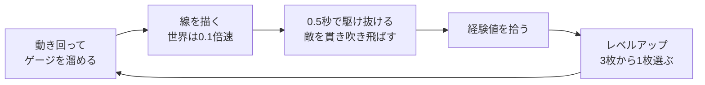
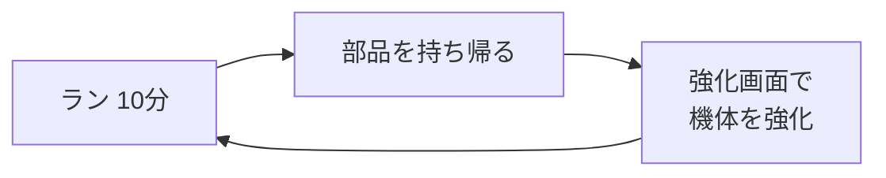

# SPEED 企画書

最終更新：2026-10-09

この文書は、読んだ人がゲームの姿を具体的に思い浮かべられるようにするためのもの。エンジニア以外も読む前提で、数値は書くが技術的な話は書かない。各仕組みの正確な条件と数値は [仕様書](spec.md)、作り方は [設計書](design.md) にある。

ゲームの中身は、ブラウザ版 demo の描画版（`draw`）で実装されているものを引き継ぐ。ゲームの構成・世界観・キャラクターデザイン（3章・15章・16章）は、2026-10-08 にまとめた「世界観・デザインの方針」の記述を正とし、作業履歴の記述より優先する。まだ決まっていないものは「未決」、話し合いの途中のものは「相談中」と書く。判断の経緯は作業ユーザーごとの履歴（[wakida.md](wakida.md) など）にある。

---

## 0. 概要

『SPEED』は、2D 見下ろし型のサバイバーアクション。プレイヤーは星を目印に星系間を航海するパイロットとなって、星座から生まれたモンスターの大群をさばきながら、星々をモンスターに変えている元凶を倒すことに挑む。舞台は星系を行き来する未来の宇宙で、ギリシャ神話の星座をモチーフにしている。ゲームを通じて、プレイヤーは**迫り来る脅威を自分の高速移動で蹂躙し、快感に変える**体験を味わう。

## 1. 体験の目標

**コンセプト**：敵の大群に対して高速移動で立ち向かい、一気に吹き飛ばして圧倒する快感を楽しむゲーム。迫り来る敵の脅威に対して、高速移動によって敵を蹂躙することで、脅威を快感へと変える。

仕様を変えるときは、次の3つの問いで確かめる。

1. 迫り来る敵の大群に脅威を感じるか
2. 自分の操作による高速移動で立ち向かう手応えがあるか
3. 一気に吹き飛ばして圧倒することで、脅威が快感に変わるか

**デザインの方針**

- ルートを思いついたら、それを楽に入力できるようにする。操作の存在を意識させない。
- うまく大量に倒すと、それが次の攻撃につながる。
- 「計画に工夫の余地がない」「工夫しても報われない」状態をつくらない。
- このゲームは、高みを目指して実際にたどり着くことを楽しむもの。負けは明確に悪く、勝つことが目標。何かを犠牲にして戦う話にはしない。

## 2. 基本情報

| 項目 | 内容 |
|---|---|
| ジャンル | 2D 見下ろし型のサバイバーアクション（ローグライト要素あり） |
| 人数 | 1人 |
| 構成 | 5ステージ（中ボス4つ＋ラスボス）と、ハイスコアを目指すエンドレスモード（3章） |
| 1回の長さ | 今の仕様では1ラン10分。各ステージ・エンドレスモードの長さは未決 |
| 対象 | 商用のゲームとして出す。PC を最優先し、最終的にはスマホとブラウザにも対応する |
| 入力 | PC はマウス、スマホはタッチ。ゲームパッドは一旦対応しない |
| 配布 | 最初は Steam。最終的に itch.io とスマホのストアにも出す |
| 画面 | 特定の解像度・縦横比に固定しない |

## 3. ゲームの構成と勝敗

### 3.1 構成

- ステージは5つ。中ボスのステージが4つと、ラスボスのステージ。
- ハイスコアを目指すエンドレスモードもある。
- ADV パートのようなものはあまり入れない。

### 3.2 ステージ

- 各ステージは星系を舞台にした、広めのフィールド。
- フィールド内を大きく動き回る意味を持たせたい（方法は未定）。
- ステージの順番は、中ボスの星の数（中ボスの星座と、取り込んでいる星座の星の合計）が少ない順。

| 順 | 星系 | 星の数 |
|---|---|---|
| 1 | いっかくじゅう座 ＋ とも座 | 6 ＋ 9 ＝ 15個 |
| 2 | ケンタウルス座 ＋ ほ座 | 11 ＋ 5 ＝ 16個 |
| 3 | おおいぬ座 ＋ りゅうこつ座 | 8 ＋ 9 ＝ 17個 |
| 4 | うみへび座 ＋ らしんばん座 | 17 ＋ 3 ＝ 20個 |
| 5 | 元凶の待つ星系 | — |

### 3.3 中ボスの戦い方

| 中ボス | 戦い方 |
|---|---|
| うみへび座 | 首を複数生やして、同時に複数の場所を攻撃する |
| いっかくじゅう座 | 高速で移動する。角を弱点にするかは検討中 |
| おおいぬ座 | 爆発系のギミックを使うかもしれない |
| ケンタウルス座 | 弓を使った攻撃。弦や糸を絡めたギミック |

### 3.4 ステージの仕掛け（オデュッセイアの難所）

中ボスのステージごとに、オデュッセイアの難所を一つ、フィールドの仕掛けとして使う。物語としては語らない。

| ステージ | 元の場面 | フィールドでの使い方 |
|---|---|---|
| うみへび座 | スキュラとカリュブディス：狭い海峡の片側に船ごと飲み込む渦潮、もう片側に首を伸ばして船乗りをさらう怪物がいて、どちらに寄って通るかを選ばされる | 自機を引き込む渦の領域を置く。渦を避けると、うみへび座の首が届く範囲を通ることになる。どちらのリスクを取って進むかを選ばせる |
| いっかくじゅう座 | アイオロスの風の袋：逆風を閉じ込めた袋を仲間が開けてしまい、あふれ出した風で船が吹き戻される | 強い風の流れを置く。自機の移動や描いた軌跡が、風の向きに押し流される。いっかくじゅう座は風に乗って高速で動き回る |
| おおいぬ座 | 太陽神ヘリオスの島：手を出してはいけない聖なる牛に仲間が手を出し、船が雷に打たれる | 触れてはいけない明るい光の塊を置く。軌跡で触れると爆発する。おおいぬ座の明るい星・爆発のギミックと合わせる |
| ケンタウルス座 | セイレーンの歌：歌声で船乗りを引き寄せて難破させる海を、オデュッセウスは自分を帆柱に縛り付けさせて切り抜ける | 自機を引き寄せる歌の領域を置く。ケンタウルス座の弦や糸のギミックで、自機の動きが縛られる場面と組み合わせる |

### 3.5 伝説のモジュール

- 中ボスを倒すと、対応する伝説のモジュールが手に入る。全部で4つ。
- 機体の性能には効かない。お宝として集めるだけ（ビルドの楽しみを崩さないため）。
- 4つという数は、武器を4つまで持てる仕組みと対になる。

### 3.6 ラスボス戦と締め

1. ラスボスと普通に戦う。
2. 倒したと思わせた後、ラスボスが最後の抵抗をし、捌ききれない強敵と共に襲ってくる。
3. 4つのモジュールがそろって伝説の機体が完成し、それまでの制限が外れる。描ける長さが無限になり、時間も大きく伸び、その間は世界が停止する。
4. 止まった世界で、敵を通る軌跡を描きまくる。
5. 解除されると、超加速した機体がラスボスに攻撃を叩き込みまくり、最後に自動でまっすぐ貫く。ラスボスは大爆発と共に散る。

### 3.7 今の仕様での勝敗

ステージごとの勝敗はまだ決まっていない。demo から引き継いだ今の仕様では、1回のランを次のように扱う。

- **クリア**：7分ごろに現れるボスを、ラン開始から10分以内に倒す。ボスが出たあとも通常の敵は湧き続ける。
- **失敗**：機体の HP がなくなる、または10分が過ぎる。
- いまのボスは仮のもの（大型の戦艦）。

## 4. 最も重要なアクション：線を描いて駆け抜ける

このゲームの中心は「描いて、駆け抜ける」こと。

1. **溜める**：高速攻撃のゲージは時間で溜まり、6秒で満タンになる。25%以上あれば使える。
2. **描く**：画面の好きな場所をクリックすると、そこから線を描き始める。ボタンは押し続けず、マウスを動かすだけで線が伸びる。描いている間、世界は普段の0.1倍の速さまでゆっくりになり、敵の動きを見ながら考えられる。満タンなら長さ1000まで描ける（止まっているとき、画面の短い辺に見える範囲がおよそ1100）。ゲージが少ないほど短くなる。
3. **駆け抜ける**：もう一度クリックするか、描ける長さを使い切ると、機体は線の始点へ跳び、線全体を約0.5秒でなぞる。線上の敵は体当たりで貫かれ、線の左右45の範囲にいる敵にも波動が当たる。
4. **勢いが残る**：なぞり終えたあとも速さは落ちず、カーソルで向きを変えながら突き進める。雑魚を貫いても減速しない。硬い敵や惑星にぶつかったとき、敵の弾を受けたときなどに普段の移動へ戻る。

使ったゲージは、実際に描いた長さの分だけ減る。満タンから4割の長さだけ描けば、6割残る。25%以上残っていれば、すぐに次の線を描ける。

描いている間に「どの群れをどう通すか」を考え、なぞる間は一気に吹き飛ばす。この切り替えが、このゲームの緩急になる。

## 5. 操作

| 機器 | 操作 | 動き |
|---|---|---|
| PC | カーソルを動かす | 機体がカーソルの方向へ進む（クリック不要。速さは最高速度の40%） |
| PC | 左クリック | 線を描き始める／描き終えて駆け抜ける |
| PC | クリックまたは数字キー1〜3 | レベルアップの3択から選ぶ |
| PC | Esc | ポーズ |
| PC | M | 音のオン・オフ（最初は消音） |
| スマホ | 画面を押してずらす（仮想スティック） | 倒した方向へ進む。大きく倒すほど速い（最高速度の40〜75%） |
| スマホ | 指でなぞる | 線を描く |

- 機体は回転しない丸い形で描く。回転すると違和感があるため。

## 6. コアループ

- 短い周期（数秒〜数十秒）：溜める → 描く → 駆け抜ける → 倒す → 拾う → 強くなる。
- 長い周期（ラン単位）：ランで集めた部品で機体の基礎性能を上げ、次のランへ。

## 7. 1ランの流れ

10分の中で、敵の量と強さを時間ごとに変えて体験の山と谷をつくる。時間帯の名前は作り手が使うためのもので、**ゲーム画面には出さない**。プレイヤーへの説明では「〜分ごろ」と時間で言う。

| 時間 | 時間帯 | 画面にいる敵の数 | ねらい |
|---|---|---|---|
| 0:00〜2:30 | 強化期 | 70 → 225体 | 弱い敵を吹き飛ばして機体を育てる |
| 2:30〜4:00 | 圧力期 | 225 → 350体 | 装甲型・射撃型が混ざり、敵が硬くなる |
| 4:00〜5:00 | 強化期 II | 190 → 225体 | 経験値が1.4倍。今のうちに組み上げる |
| 5:00〜6:00 | 無双期 | 700 → 1300体 | 弱い群れが大量に来る。まとめて貫く |
| 6:00〜8:30 | 緊張期 | 350 → 550体 | 互角の相手。7分ごろボスが現れる |
| 8:30〜10:00 | 脱出期 | 450 → 600体 | 最も強い敵。出力コアで最高速度を上げられる |

## 8. 主なルール

- **触れたときの扱い**：普段の速さで敵に触れるとダメージを受ける。線をなぞっている間、なぞったあとの勢いがある間、または最高速度の65%以上で動いている間は、触れると体当たり攻撃になる。
- **装甲**：攻撃力が敵の装甲以上なら貫き、下回れば弾かれて止まる。攻撃力は速さと関係なく、強化で上がる。
- **クリティカル**：5%の確率で威力2.5倍。装甲も半分の値で判定する。装甲型と戦艦は背中が黄色く光り、背中から当てると必ずクリティカルになる。
- **機体**：HP 120。ダメージを受けると0.6秒間は無敵。
- **敵の狙いは遅れる**：敵は機体の0.5秒遅れの位置を狙う。普段の移動ならほぼ追いつかれるが、駆け抜けた直後は狙いを置き去りにできる。
- **地形**：中央の惑星と、その周りを回る6つの月は障害物。ぶつかると弾かれ、線もそこで止まる。重力はない（邪魔に感じたため外した）。
- **手応えの間**：敵を一撃で倒すたびに、ほんの一瞬（0.045秒）画面が止まる。

## 9. 判断と葛藤

demo の仕組みから読み取れる、プレイヤーが迷うところ。

| 観点 | 内容 |
|---|---|
| 繰り返す行動 | 動き回ってゲージを溜め、線を描いて駆け抜ける |
| 迷うところ | 25%で短くすぐ使うか、満タンまで待って硬い敵ごと抜くか 長く描いて多く巻き込むか、硬い敵や地形で止まる危険を避けるか 経験値を拾いに群れへ近づくか、触れると傷つくので距離を取るか 3択でどの武器・特性を伸ばすか |
| 自然とやりたくなること | 一筆でできるだけ多く巻き込みたい。硬い敵を貫けるようになりたい |
| 感情の動き | 迫られる圧迫感 → 線を描く集中 → 一気に吹き飛ばす解放感。ランの中でも、圧力期・緊張期の圧迫と無双期の解放を繰り返す |
| それを繰り返し生む仕組み | 時間帯ごとの敵の量と強さ、ゲージの溜まる時間、敵の狙いの遅れ、装甲 |

## 10. ラン中の成長

- 敵を倒すと紫の経験値の結晶が出る。拾ってレベルが上がると、3枚のカードから1枚を選ぶ。
- カードは「新しい武器」「武器の強化」「特性」の3種類から出る。武器は4つまで持て、それぞれ Lv5 まで上がる。特性は6つまで持て、同じものを5回まで重ねられる。最初はブラスター Lv1 を持っている。
- カードの枠の色は強化の段階を表す：1＝白、2＝緑、3＝青、4＝紫、5＝金。
- **リロール**：3枚のカードを引き直せる。狙ったビルドを組みやすくするための仕組み。1回のランで3回まで。強化画面の強化で回数を増やせる。
- レベルが1上がるごとに、最高速度+2%、攻撃力+2%、最大 HP+4、HP 8%回復。
- 8:30以降、フィールドの中心付近に**出力コア**が現れる。1個で最高速度+18%。

**武器（9種）**

| 名前 | ひとことで |
|---|---|
| ブラスター | 進む方向へ自動で撃つ |
| 散弾砲 | 扇状に撃つ |
| 吹き飛ばし衝角 | 体当たりした敵を吹き飛ばし、ほかの敵にぶつける |
| 接触波動 | 高速で触れるたびに周りへ波動 |
| バリアシステム | 周りに定期的な波動を出し、敵の弾を防ぐ |
| 追走ドローン | 周りを回って撃ち、駆け抜けた線を遅れて追う |
| 軌跡機雷 | 駆け抜けた線に機雷を残す |
| ソニックブーム | 駆け抜け始めと一定間隔で、進路ごと大きな衝撃波 |
| 接触電撃 | 触れた敵から近くの敵へ電撃がつながる |

**特性（14種）**

| 名前 | ひとことで |
|---|---|
| 終端爆縮 | 線の終点で爆発 |
| 交差爆破 | 前の線と交わった点で爆発 |
| 余韻の渦 | 線の終点に敵を吸い寄せる渦 |
| 満タン突撃 | 満タンから使うと装甲を無視して威力も上がる |
| 連鎖ソニック | 1回で何体も倒すと衝撃波 |
| クリティカルランス | クリティカルのたびに前方へ貫くビーム |
| 急速充填 | ゲージが早く溜まる |
| 大容量チャージ | 1回で描ける長さが伸びる |
| クリティカル率 | クリティカルが出やすくなる |
| 最高速度 | 速くなり、描ける長さも伸びる |
| 攻撃力 | すべての攻撃が強くなる |
| 広域回収 | 遠くのアイテムも拾える |
| 反応波動 | ダメージを受けたとき周りを押し返す |
| 軌跡延長 | 描ける長さが伸びる |

数値は [武器一覧](weapons.md)・[特性一覧](traits.md) にある。

## 11. 敵と脅威

敵は画面の外から絶えず補充され、5〜6分ごろには画面に1000体を超える群れが押し寄せる。

| 敵 | 役割 |
|---|---|
| ドリフター | 基本の追ってくる敵 |
| スウォーム | 小さく速い。無双期の群れの主役 |
| ダーター | 近づくと構えてから突進してくる |
| 装甲型 | 硬い。背中が弱点 |
| 分裂型 | 時間がたつと分裂し、倒しても2体に分かれる |
| 分裂体 | 分裂型から生まれる小型の敵 |
| 減速型 | 周りにいると機体が遅くなり、貫くと勢いを吸われる |
| 射撃型 | 距離を取って弾を撃つ |
| ミサイル艇 | さらに遠くから誘導弾を撃つ |
| 戦艦 | 大型。扇状に弾をばらまく。背中が弱点 |
| タイタン | 大型の追ってくる敵 |
| ボス（仮） | 7分ごろ1体現れる大型戦艦。撃破でクリア |

- 半径50以上の大型の敵を倒すと、6〜12個の破片が飛び散り、周りの敵を巻き込む。大物を倒すこと自体がご褒美になる。
- フィールドには**隕石**が浮かんでいる。壊すと8%で修理キット（HP 10%回復）、4%で経験値を一括で回収するビーコン、40%で部品を落とす。
- フィールドの中央付近と外縁は危険地帯で、強い敵が出やすい。

敵の数値は [敵一覧](enemies.md) にある。

## 12. ランをまたぐ成長

- ラン中に**部品**を拾って集める。部品は隕石・エリートの敵・戦艦などが落とす。クリアするとさらに30個もらえる。
- **強化画面**で、部品を使って機体の基礎性能を上げる。
- 武器・特性などプレイ中に手に入れたものは、ステージをまたいで持ち越さない。
- **図鑑**：一度手に入れたモジュール（武器・特性・伝説のモジュールのすべて）は、図鑑で詳細を見られる。一度も手に入れたことがないものはシルエットだけ表示する。

| 強化 | 1段階ごとの効果 | 最大 |
|---|---|---|
| 主推進器 | 最高速度+5% | 5段階 |
| 機体フレーム | 最大 HP+15 | 5段階 |
| 衝角素材 | 攻撃力+6% | 5段階 |
| 充電効率 | ゲージの溜まる時間−5% | 5段階 |
| 回収装置 | 回収範囲+15% | 5段階 |
| 学習回路 | 経験値+8% | 5段階 |
| 演算予備 | リロール+1回 | 3段階 |

## 13. 手応えと演出

- 一撃で倒すと一瞬止まる（ヒットストップ）。大型の敵は1.8倍、クリティカルは1.3倍長く止まる。
- 吹き飛ばした敵は、回転する金属の破片になって飛び、飛んだ跡に光の筋を残す。
- 装甲に弾かれたときは、ぶつかった面から火花が散り、止めた敵の装甲が光る。群れの中でもどの敵に止められたかが分かる。
- クリティカルで貫いたときは、炎が噴き出して赤く焼ける。
- ダメージを受けると、機体が一瞬赤くなって小さく揺れる。画面全体は揺らさない。
- **敗北**：最後の一撃を受けた瞬間、世界が1秒止まり、機体以外が暗くなる。機体が砕け散り、GAME OVER を表示して結果画面へ。
- **ボス撃破**：トドメの瞬間を機体に寄ってスローで再生する。ボスが大爆発して残りの敵を一掃し、破片が消えたあとに CLEAR! を表示する。

## 14. 画面と情報の見せ方

**画面の流れ**：タイトルには「ゲームスタート」「設定」「終了」。「ゲームスタート」でメインメニューへ。メインメニューには「ステージ選択」「機体の強化」「図鑑」のボタンがあり、押すとそれぞれの画面へ移る。エンドレスモードはステージ選択で選ぶ。ステージを選ぶとラン → 結果 → メインメニュー、またはもう一度。ラン中にポーズと3択のカードが重なり、ポーズからメインメニューに戻れる。どの画面からも前の画面へ戻れる。

**情報の優先度**

| 見る頻度 | 情報 | 場所 |
|---|---|---|
| 常に | 機体の周り、敵、弾、経験値 | 画面の中央 |
| 常に | ゲージの溜まり具合（描いている間は残りの長さ） | カーソルの近くのリング。25%以上で緑、満タンで金 |
| 常に | HP | 機体の真下のバー |
| ときどき | 残り時間、経験値、速さ | 上部中央、画面の上端、下部中央 |
| ときどき | 攻撃力、撃破数、レベル、部品 | 左上 |
| ときどき | 持っている武器の Lv と特性の重ね数 | 左下の一覧（色は強化の段階） |
| 出たとき | ボスの HP、WARNING!!、画面外のボスの方向 | 画面の上と端 |
| たまに | 機体の基礎強化 | 強化画面 |

**見分けのルール**：経験値は紫の結晶、敵の弾は赤いリング、味方の弾は水色の細長い弾、攻撃する破片は金属色と橙の光、修理キットは十字の白いケース、隕石は灰茶の岩。形と色の両方で見分けられるようにする。

## 15. 世界観と物語

### 15.1 ストーリー

人々が星系の間を行き来するようになった未来。主人公は、星を目印にして星系間を航海するパイロットだ。

ある日、いつも目印にしていた星が、突然モンスターとなって襲いかかってくる。応戦して倒すと、モンスターは元の星に戻った。星は、何者かにモンスターへと変えられていたのだ。倒せば元に戻せると気付いたパイロットは、星々をモンスターに変えている原因を突き止めるため、旅に出る。

旅の先々の星系では、星座から生まれたモンスターたちが大群で押し寄せてくる。その奥には、それぞれの星系の主ともいえる強大なモンスターが待ち構えている。うみへび座、いっかくじゅう座、おおいぬ座、ケンタウルス座。それぞれが、アルゴ船にまつわる星座（らしんばん座、とも座、りゅうこつ座、ほ座）を体に取り込んでいる。倒して星座を解放すると、錆びついた、正体の分からない何かが残される。形だけは機体のモジュールに似ている。

4つの星系を越えた先で、パイロットはついに元凶にたどり着く。星を飲み込み、モンスターに変えていた存在だ。激しい戦いの末に倒したかに見えたそのとき、元凶は最後の抵抗に出る。捌ききれないほどの強敵の大群と共に襲いかかってくる元凶。その瞬間、集めてきた4つのモジュールが一つに組み合わさり、伝説の機体が完成する。機体の制限が外れ、世界が止まる。止まった世界を駆け抜けたパイロットは元凶を貫き、元凶は大爆発と共に散る。

### 15.2 舞台

- 宇宙。星系を行き来する、技術の進んだ未来（SF）。

### 15.3 起きていること

- 星を飲み込み、モンスターに変えてしまう存在（ラスボス）がいる。
- 星座がモンスターに変えられ、星系に大群で現れている。モンスターを倒すと、元の星に戻る。

### 15.4 星座

- ギリシャ神話の星座を、敵・ボスのモチーフにする。神話の設定はそのまま持ち込まない。

### 15.5 中ボスと取り込まれた星座

| 中ボス（生き物の星座） | 取り込んでいる星座（アルゴ船にまつわる物の星座） |
|---|---|
| いっかくじゅう座 | とも座（船尾） |
| ケンタウルス座 | ほ座（帆） |
| おおいぬ座 | りゅうこつ座（竜骨） |
| うみへび座 | らしんばん座（羅針盤） |

### 15.6 伝説の機体

- 中ボスから解放された4つのモジュールが組み合わさると、伝説の機体ができあがる。

### 15.7 ラスボス

- 星を飲み込んでモンスターに変えている元凶。詳細は後で決める。

## 16. キャラクターデザインと見た目・音

### 16.1 敵

- 雑魚の敵は、単純な形状で、星を一つ取り込んでいる。
- 強めの敵は、何かしらの星座をモチーフにする。3〜5個くらいの星でできる星座を使う。
- 敵の強さは、星の数に比例する。
- 強めの敵にどの星座を使うかは未定。

### 16.2 中ボス

- ボスは、金色のパーツを取り込んでいることが分かるデザインにする。
- それぞれのボスの印象が被らないカラーリング・デザインにする。

**うみへび座（取り込んでいる星座：らしんばん座）**

- **うみへび座：** ギリシャ神話の怪物ヒュドラ。沼地に棲む多頭の大蛇で、首を1本切るとそこから2本生えてくる。息や血に猛毒があり、ヘラクレスは傷口を火で焼いて再生を止めて倒した。88星座の中で一番面積が広い。一番明るい星アルファルドは「孤独なもの」という意味。
- **らしんばん座：** 航海用の羅針盤の星座。18世紀にラカーユが作った。アルゴ座のすぐそばにあるが、元のアルゴ座には含まれていない。19世紀に「マスト」に改名してアルゴ座に組み込む案が出たが、採用されなかった。
- **アートの方針：** 巨大な敵として使う。

**いっかくじゅう座（取り込んでいる星座：とも座）**

- **いっかくじゅう座：** 一角獣。17世紀に作られた星座で、ギリシャ神話の話はない。ヨーロッパの伝承では、誰にも飼い慣らせない荒々しい獣で、足が速く、角には毒を清める力があるとされた。天の川の中にあり、バラ星雲がある。
- **とも座：** アルゴ船の船尾。1755年にラカーユがアルゴ座を分けてできた3つ（りゅうこつ座・とも座・ほ座）のうちの一つ。
- **アートの方針：** 未定。

**おおいぬ座（取り込んでいる星座：りゅうこつ座）**

- **おおいぬ座：** 狙った獲物を必ず捕らえる猟犬ライラプスとされることがある。決して捕まらない狐を追い続け、決着がつかないまま両方とも石に変えられた。口元に全天で一番明るい星シリウスがあり、名前は「焼き焦がすもの」に由来する。
- **りゅうこつ座：** アルゴ船の竜骨。アルゴ座が分けられた3つのうちの一つ。全天で二番目に明るい星カノープス（名前はスパルタ王メネラオスの船の舵取りに由来）と、りゅうこつ座大星雲がある。
- **アートの方針：** 明るい星であることを生かした設定にしたい。

**ケンタウルス座（取り込んでいる星座：ほ座）**

- **ケンタウルス座：** 上半身が人、下半身が馬のケンタウロス。中でもケイロンは英雄たちを育てた賢い師で、弓と医術に長け、アルゴ船の船長イアソンの師でもあった。神話ではヒュドラの毒矢で傷を負う。太陽系に一番近い恒星アルファ・ケンタウリがある。
- **ほ座：** アルゴ船の帆。アルゴ座が分けられた3つのうちの一つ。超新星爆発の残骸と、ほ座パルサーがある。
- **アートの方針：** 未定。

### 16.3 伝説のモジュール

- 入手時は錆びていて、何かは分からない。形だけはモジュールに似ていて、「もしかして？」と思わせる程度。

### 16.4 見た目と音の現状

- いまの demo の見た目（戦艦・隕石・惑星・月）は仮置き。
- 14章の見分けのルールと「回転しない丸い機体」は引き継ぐ。
- 音の方向性は未決。いまは効果音とエンジン音のみ（BGM なし）で、最初は消音。

## 17. 参考作品

| 作品 | 参考にする点 |
|---|---|
| Vampire Survivors | 自動攻撃、大群、3択の成長というジャンルの土台 |
| Boomerang X | 高速移動 → スローで狙う → 高速移動の緩急。たくさん倒すと強い攻撃が使える |
| Nova Drift | 組み合わせで攻撃が大きく変わる成長。完成したビルドで大群を処理する快感 |
| Flight Control | 描いた経路を機体がたどるので意図が伝わりやすい。「クリック → 押さずに描く → クリック」の入力 |
| Transistor | 止まった時間で計画して一気に実行する。計画が外れると報われない、という注意点 |
| Draw Slasher | 線で移動と攻撃を兼ねる。押したまま大きく描き続けるのは疲れる、という注意点 |

分析の詳細は作業者の Obsidian のメモにある。

## 18. 未決事項

| 項目 | 状態 |
|---|---|
| ラスボスの詳細 | 未定 |
| 強めの敵に使う星座（3〜5個の星） | 未定 |
| フィールドを動き回る意味の持たせ方 | 未定 |
| 自機・パイロット・伝説の機体の見た目 | 未定 |
| 各ステージ・エンドレスモードの長さと勝敗 | 未決 |
| いっかくじゅう座の角を弱点にするか | 検討中 |
| 音の方向性 | 未決 |
| 早く強くなりすぎたとき、少し遅れて敵を強くする仕組み | 採用、数値は相談中 |
| 光る特別な隕石と、そこでしか手に入らない武器 | 案（効果・頻度・装備のしかたは未決） |
