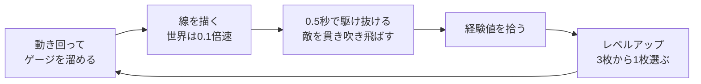
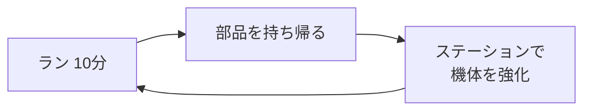

# SPEED 企画書

最終更新：2026-10-07

この文書は、読んだ人がゲームの姿を具体的に思い浮かべられるようにするためのもの。エンジニア以外も読む前提で、数値は書くが技術的な話は書かない。各仕組みの正確な条件と数値は [仕様書](spec.md)、作り方は [設計書](design.md) にある。

ゲームの中身は、ブラウザ版 demo の描画版（`draw`）で実装されているものを引き継ぐ。まだ決まっていないものは「未決」、話し合いの途中のものは「相談中」と書く。判断の経緯は作業ユーザーごとの履歴（[wakida.md](wakida.md) など）にある。

---

## 0. 概要

『SPEED』は、2D 見下ろし型のサバイバーアクション。プレイヤーは高速攻撃を持つ機体となって、四方から押し寄せる敵の大群をさばきながら、10分以内にボスを倒すことに挑む。舞台は宇宙で、モチーフは星座とギリシャ神話（中身は相談中）。ゲームを通じて、プレイヤーは**迫り来る脅威を自分の高速移動で蹂躙し、快感に変える**体験を味わう。

## 1. 体験の目標

**コンセプト**：敵の大群に対して高速移動で立ち向かい、一気に吹き飛ばして圧倒する快感を楽しむゲーム。迫り来る敵の脅威に対して、高速移動によって敵を蹂躙することで、脅威を快感へと変える。

仕様を変えるときは、次の3つの問いで確かめる。

1. 迫り来る敵の大群に脅威を感じるか
2. 自分の操作による高速移動で立ち向かう手応えがあるか
3. 一気に吹き飛ばして圧倒することで、脅威が快感に変わるか

**デザインの方針**

- ルートを思いついたら、それを楽に入力できるようにする。操作の存在を意識させない。
- うまく大量に倒すと、それが次の攻撃につながる。
- 「計画に工夫の余地がない」「工夫しても報われない」状態をつくらない。
- このゲームは、高みを目指して実際にたどり着くことを楽しむもの。負けは明確に悪く、勝つことが目標。何かを犠牲にして戦う話にはしない。

## 2. 基本情報

| 項目 | 内容 |
|---|---|
| ジャンル | 2D 見下ろし型のサバイバーアクション（ローグライト要素あり） |
| 人数 | 1人 |
| 1回の長さ | 1ラン10分 |
| 対象 | PC を最優先。最終的にはスマホにも対応する |
| 入力 | PC はマウス、スマホはタッチ。ゲームパッドへの対応は未決 |
| 画面 | 特定の解像度・縦横比に固定しない |

## 3. 目的と勝敗

- **クリア**：7分ごろに現れるボスを、ラン開始から10分以内に倒す。ボスが出たあとも通常の敵は湧き続ける。
- **失敗**：機体の HP がなくなる、または10分が過ぎる。
- いまのボスは仮のもの（大型の戦艦）。攻撃の仕掛け（ギミック）はまだ考えていない。
- 将来は複数ステージにして、最後にラスボスとの決着を置く構想がある（相談中。15章）。

## 4. 最も重要なアクション：線を描いて駆け抜ける

このゲームの中心は「描いて、駆け抜ける」こと。

1. **溜める**：高速攻撃のゲージは時間で溜まり、6秒で満タンになる。25%以上あれば使える。
2. **描く**：画面の好きな場所をクリックすると、そこから線を描き始める。ボタンは押し続けず、マウスを動かすだけで線が伸びる。描いている間、世界は普段の0.1倍の速さまでゆっくりになり、敵の動きを見ながら考えられる。満タンなら長さ1000まで描ける（止まっているとき、画面の短い辺に見える範囲がおよそ1100）。ゲージが少ないほど短くなる。
3. **駆け抜ける**：もう一度クリックするか、描ける長さを使い切ると、機体は線の始点へ跳び、線全体を約0.5秒でなぞる。線上の敵は体当たりで貫かれ、線の左右45の範囲にいる敵にも波動が当たる。
4. **勢いが残る**：なぞり終えたあとも速さは落ちず、カーソルで向きを変えながら突き進める。雑魚を貫いても減速しない。硬い敵や惑星にぶつかったとき、敵の弾を受けたときなどに普段の移動へ戻る。

使ったゲージは、実際に描いた長さの分だけ減る。満タンから4割の長さだけ描けば、6割残る。25%以上残っていれば、すぐに次の線を描ける。

描いている間に「どの群れをどう通すか」を考え、なぞる間は一気に吹き飛ばす。この切り替えが、このゲームの緩急になる。

## 5. 操作

| 機器 | 操作 | 動き |
|---|---|---|
| PC | カーソルを動かす | 機体がカーソルの方向へ進む（クリック不要。速さは最高速度の40%） |
| PC | 左クリック | 線を描き始める／描き終えて駆け抜ける |
| PC | クリックまたは数字キー1〜3 | レベルアップの3択から選ぶ |
| PC | Esc | ポーズ |
| PC | M | 音のオン・オフ（最初は消音） |
| スマホ | 画面を押してずらす（仮想スティック） | 倒した方向へ進む。大きく倒すほど速い（最高速度の40〜75%） |
| スマホ | 指でなぞる | 線を描く |

- 機体は回転しない丸い形で描く。回転すると違和感があるため。

## 6. コアループ

- 短い周期（数秒〜数十秒）：溜める → 描く → 駆け抜ける → 倒す → 拾う → 強くなる。
- 長い周期（ラン単位）：ランで集めた部品で機体の基礎性能を上げ、次のランへ。

## 7. 1ランの流れ

10分の中で、敵の量と強さを時間ごとに変えて体験の山と谷をつくる。時間帯の名前は作り手が使うためのもので、**ゲーム画面には出さない**。プレイヤーへの説明では「〜分ごろ」と時間で言う。

| 時間 | 時間帯 | 画面にいる敵の数 | ねらい |
|---|---|---|---|
| 0:00〜2:30 | 強化期 | 70 → 225体 | 弱い敵を吹き飛ばして機体を育てる |
| 2:30〜4:00 | 圧力期 | 225 → 350体 | 装甲型・射撃型が混ざり、敵が硬くなる |
| 4:00〜5:00 | 強化期 II | 190 → 225体 | 経験値が1.4倍。今のうちに組み上げる |
| 5:00〜6:00 | 無双期 | 700 → 1300体 | 弱い群れが大量に来る。まとめて貫く |
| 6:00〜8:30 | 緊張期 | 350 → 550体 | 互角の相手。7分ごろボスが現れる |
| 8:30〜10:00 | 脱出期 | 450 → 600体 | 最も強い敵。出力コアで最高速度を上げられる |

## 8. 主なルール

- **触れたときの扱い**：普段の速さで敵に触れるとダメージを受ける。線をなぞっている間、なぞったあとの勢いがある間、または最高速度の65%以上で動いている間は、触れると体当たり攻撃になる。
- **装甲**：攻撃力が敵の装甲以上なら貫き、下回れば弾かれて止まる。攻撃力は速さと関係なく、強化で上がる。
- **クリティカル**：5%の確率で威力2.5倍。装甲も半分の値で判定する。装甲型と戦艦は背中が黄色く光り、背中から当てると必ずクリティカルになる。
- **機体**：HP 120。ダメージを受けると0.6秒間は無敵。
- **敵の狙いは遅れる**：敵は機体の0.5秒遅れの位置を狙う。普段の移動ならほぼ追いつかれるが、駆け抜けた直後は狙いを置き去りにできる。
- **地形**：中央の惑星と、その周りを回る6つの月は障害物。ぶつかると弾かれ、線もそこで止まる。重力はない（邪魔に感じたため外した）。
- **手応えの間**：敵を一撃で倒すたびに、ほんの一瞬（0.045秒）画面が止まる。

## 9. 判断と葛藤

demo の仕組みから読み取れる、プレイヤーが迷うところ。

| 観点 | 内容 |
|---|---|
| 繰り返す行動 | 動き回ってゲージを溜め、線を描いて駆け抜ける |
| 迷うところ | 25%で短くすぐ使うか、満タンまで待って硬い敵ごと抜くか 長く描いて多く巻き込むか、硬い敵や地形で止まる危険を避けるか 経験値を拾いに群れへ近づくか、触れると傷つくので距離を取るか 3択でどの武器・特性を伸ばすか |
| 自然とやりたくなること | 一筆でできるだけ多く巻き込みたい。硬い敵を貫けるようになりたい |
| 感情の動き | 迫られる圧迫感 → 線を描く集中 → 一気に吹き飛ばす解放感。ランの中でも、圧力期・緊張期の圧迫と無双期の解放を繰り返す |
| それを繰り返し生む仕組み | 時間帯ごとの敵の量と強さ、ゲージの溜まる時間、敵の狙いの遅れ、装甲 |

## 10. ラン中の成長

- 敵を倒すと紫の経験値の結晶が出る。拾ってレベルが上がると、3枚のカードから1枚を選ぶ。
- カードは「新しい武器」「武器の強化」「特性」の3種類から出る。武器は4つまで持て、それぞれ Lv5 まで上がる。特性は6つまで持て、同じものを5回まで重ねられる。最初はブラスター Lv1 を持っている。
- カードの枠の色は強化の段階を表す：1＝白、2＝緑、3＝青、4＝紫、5＝金。
- レベルが1上がるごとに、最高速度+2%、攻撃力+2%、最大 HP+4、HP 8%回復。
- 8:30以降、フィールドの中心付近に**出力コア**が現れる。1個で最高速度+18%。

**武器（9種）**

| 名前 | ひとことで |
|---|---|
| ブラスター | 進む方向へ自動で撃つ |
| 散弾砲 | 扇状に撃つ |
| 吹き飛ばし衝角 | 体当たりした敵を吹き飛ばし、ほかの敵にぶつける |
| 接触波動 | 高速で触れるたびに周りへ波動 |
| バリアシステム | 周りに定期的な波動を出し、敵の弾を防ぐ |
| 追走ドローン | 周りを回って撃ち、駆け抜けた線を遅れて追う |
| 軌跡機雷 | 駆け抜けた線に機雷を残す |
| ソニックブーム | 駆け抜け始めと一定間隔で、進路ごと大きな衝撃波 |
| 接触電撃 | 触れた敵から近くの敵へ電撃がつながる |

**特性（14種）**

| 名前 | ひとことで |
|---|---|
| 終端爆縮 | 線の終点で爆発 |
| 交差爆破 | 前の線と交わった点で爆発 |
| 余韻の渦 | 線の終点に敵を吸い寄せる渦 |
| 満タン突撃 | 満タンから使うと装甲を無視して威力も上がる |
| 連鎖ソニック | 1回で何体も倒すと衝撃波 |
| クリティカルランス | クリティカルのたびに前方へ貫くビーム |
| 急速充填 | ゲージが早く溜まる |
| 大容量チャージ | 1回で描ける長さが伸びる |
| クリティカル率 | クリティカルが出やすくなる |
| 最高速度 | 速くなり、描ける長さも伸びる |
| 攻撃力 | すべての攻撃が強くなる |
| 広域回収 | 遠くのアイテムも拾える |
| 反応波動 | ダメージを受けたとき周りを押し返す |
| 軌跡延長 | 描ける長さが伸びる |

数値は [武器一覧](weapons.md)・[特性一覧](traits.md) にある。

## 11. 敵と脅威

敵は画面の外から絶えず補充され、5〜6分ごろには画面に1000体を超える群れが押し寄せる。

| 敵 | 役割 |
|---|---|
| ドリフター | 基本の追ってくる敵 |
| スウォーム | 小さく速い。無双期の群れの主役 |
| ダーター | 近づくと構えてから突進してくる |
| 装甲型 | 硬い。背中が弱点 |
| 分裂型 | 時間がたつと分裂し、倒しても2体に分かれる |
| 分裂体 | 分裂型から生まれる小型の敵 |
| 減速型 | 周りにいると機体が遅くなり、貫くと勢いを吸われる |
| 射撃型 | 距離を取って弾を撃つ |
| ミサイル艇 | さらに遠くから誘導弾を撃つ |
| 戦艦 | 大型。扇状に弾をばらまく。背中が弱点 |
| タイタン | 大型の追ってくる敵 |
| ボス（仮） | 7分ごろ1体現れる大型戦艦。撃破でクリア |

- 半径50以上の大型の敵を倒すと、6〜12個の破片が飛び散り、周りの敵を巻き込む。大物を倒すこと自体がご褒美になる。
- フィールドには**隕石**が浮かんでいる。壊すと8%で修理キット（HP 10%回復）、4%で経験値を一括で回収するビーコン、40%で部品を落とす。
- フィールドの中央付近と外縁は危険地帯で、強い敵が出やすい。

敵の数値は [敵一覧](enemies.md) にある。

## 12. ランをまたぐ成長

- ラン中に**部品**を拾って集める。部品は隕石・エリートの敵・戦艦などが落とす。クリアするとさらに30個もらえる。
- 出発前の**ステーション**で、部品を使って機体の基礎性能を上げる。

| 強化 | 1段階ごとの効果 | 最大 |
|---|---|---|
| 主推進器 | 最高速度+5% | 5段階 |
| 機体フレーム | 最大 HP+15 | 5段階 |
| 衝角素材 | 攻撃力+6% | 5段階 |
| 充電効率 | ゲージの溜まる時間−5% | 5段階 |
| 回収装置 | 回収範囲+15% | 5段階 |
| 学習回路 | 経験値+8% | 5段階 |

## 13. 手応えと演出

- 一撃で倒すと一瞬止まる（ヒットストップ）。大型の敵は1.8倍、クリティカルは1.3倍長く止まる。
- 吹き飛ばした敵は、回転する金属の破片になって飛び、飛んだ跡に光の筋を残す。
- 装甲に弾かれたときは、ぶつかった面から火花が散り、止めた敵の装甲が光る。群れの中でもどの敵に止められたかが分かる。
- クリティカルで貫いたときは、炎が噴き出して赤く焼ける。
- ダメージを受けると、機体が一瞬赤くなって小さく揺れる。画面全体は揺らさない。
- **敗北**：最後の一撃を受けた瞬間、世界が1秒止まり、機体以外が暗くなる。機体が砕け散り、GAME OVER を表示して結果画面へ。
- **ボス撃破**：トドメの瞬間を機体に寄ってスローで再生する。ボスが大爆発して残りの敵を一掃し、破片が消えたあとに CLEAR! を表示する。

## 14. 画面と情報の見せ方

**画面の流れ**：ステーション（出発前の強化）→ ラン → 結果 → ステーション、またはもう一度。ラン中にポーズと3択のカードが重なる。

**情報の優先度**

| 見る頻度 | 情報 | 場所 |
|---|---|---|
| 常に | 機体の周り、敵、弾、経験値 | 画面の中央 |
| 常に | ゲージの溜まり具合（描いている間は残りの長さ） | カーソルの近くのリング。25%以上で緑、満タンで金 |
| 常に | HP | 機体の真下のバー |
| ときどき | 残り時間、経験値、速さ | 上部中央、画面の上端、下部中央 |
| ときどき | 攻撃力、撃破数、レベル、部品 | 左上 |
| ときどき | 持っている武器の Lv と特性の重ね数 | 左下の一覧（色は強化の段階） |
| 出たとき | ボスの HP、WARNING!!、画面外のボスの方向 | 画面の上と端 |
| たまに | 機体の基礎強化 | ステーション |

**見分けのルール**：経験値は紫の結晶、敵の弾は赤いリング、味方の弾は水色の細長い弾、攻撃する破片は金属色と橙の光、修理キットは十字の白いケース、隕石は灰茶の岩。形と色の両方で見分けられるようにする。

## 15. 世界観・物語

**相談中**。決まったことと、まだ決まっていないことを分けて書く（番号は [wakida.md](wakida.md) の項目）。

**決まっていること**

- 舞台は宇宙（88）。
- 星座をモチーフにし、星座の体系はギリシャ神話にする（97・98）。
- 星座は敵とボス、その一部のギミックに使う。敵は1種類につき星座1つ。ステージは星系を舞台にする。世界観にもある程度からめる（99）。
- 機体の能力は「溜めて出す高速攻撃」。無茶な使い方ではなく、機体の普通の性能として出せるもの。そのうえで、敵が大量に襲ってくる非常事態に対処している（82・83）。
- 見た目は SF のまま。古典は骨組み・メッセージ・名前の付け方として借りる（84）。
- 世界観を考えるためにゲームシステムは変えない（88）。
- ラスボス戦の締め（92〜95）：ラスボスを普通に倒したと思わせたあと、ラスボスが最後の抵抗をし、さばききれない量の強敵と共に襲ってくる。そこで、それまでの制限が外れる。描ける長さが無限になり、時間も大きく伸び、その間は世界が止まる。止まった世界で敵を通る線を描きまくる。解除されると、超加速した機体がラスボスに高速の攻撃を叩き込みまくり（1機が動き回り、途中に残像が見える表現）、最後に自動でまっすぐ貫いて、ラスボスが壮大な爆発と共に散る。

**相談中のこと**

- ゲームを複数ステージにし、各ステージを広めのフィールドにする。フィールドの中を大きく動き回る意味を持たせたい（86）。
- 中ボスを倒すときの演出として、光速で艦隊を一直線に切り裂くもの（スター・ウォーズのホルド・マニューバのような）を入れる（87）。
- 締めで制限が外れる理由（97 で挙げた案はいずれも不採用）。

**まだ決まっていないこと**

- 自機は何で、誰が乗っているか。何を望み、何を恐れるか。
- 敵の大群は何で、なぜ襲ってくるか。どの敵にどの星座を割り当てるか。
- ラスボスは何か。
- どの星系を舞台にし、どう並べるか。
- 作品の根っこにあるテーマ（1章の「高みを目指して実際にたどり着く」をどう物語にするか）。

いまの demo の見た目（戦艦・隕石・惑星・月）は仮置き。

## 16. 見た目と音

- 見た目の方向性は未決。ただし、14章の見分けのルールと「回転しない丸い機体」は引き継ぐ。
- 音の方向性も未決。いまは効果音とエンジン音のみ（BGM なし）で、最初は消音。

## 17. 参考作品

| 作品 | 参考にする点 |
|---|---|
| Vampire Survivors | 自動攻撃、大群、3択の成長というジャンルの土台 |
| Boomerang X | 高速移動 → スローで狙う → 高速移動の緩急。たくさん倒すと強い攻撃が使える |
| Nova Drift | 組み合わせで攻撃が大きく変わる成長。完成したビルドで大群を処理する快感 |
| Flight Control | 描いた経路を機体がたどるので意図が伝わりやすい。「クリック → 押さずに描く → クリック」の入力 |
| Transistor | 止まった時間で計画して一気に実行する。計画が外れると報われない、という注意点 |
| Draw Slasher | 線で移動と攻撃を兼ねる。押したまま大きく描き続けるのは疲れる、という注意点 |

分析の詳細は作業者の Obsidian のメモにある。

## 18. 未決事項

| 項目 | 状態 |
|---|---|
| ボスのギミック | 未検討 |
| 世界観・物語・テーマ | 相談中（15章） |
| 複数ステージの構成 | 相談中 |
| 見た目・音の方向性 | 未決 |
| ゲームパッドへの対応 | 未決 |
| 早く強くなりすぎたとき、少し遅れて敵を強くする仕組み | 採用、数値は相談中 |
| 光る特別な隕石と、そこでしか手に入らない武器 | 案（効果・頻度・装備のしかたは未決） |
