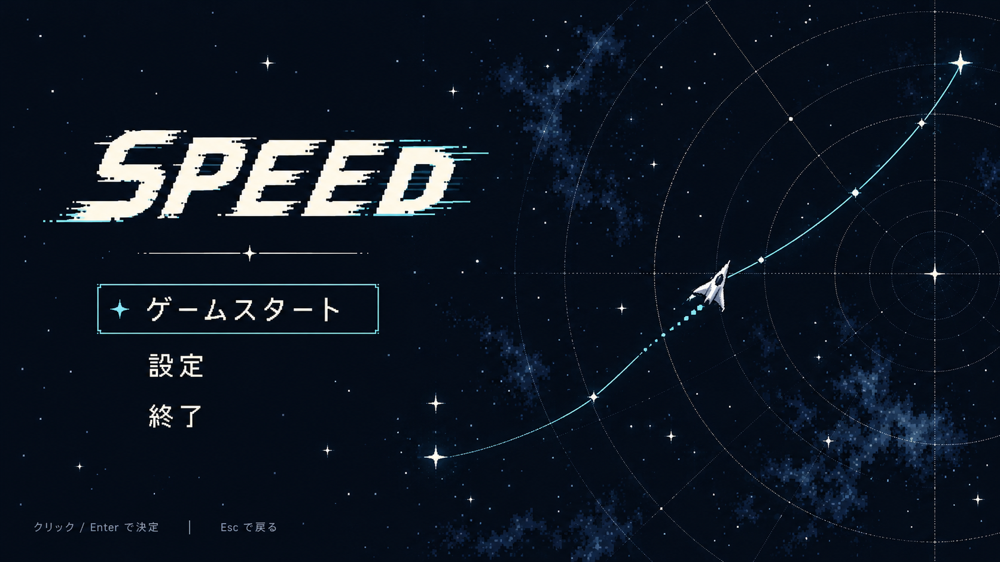

# タイトル画面の外観案（2026-10-09）

ShueMaker70969 の依頼によるアイディアと仮UI。外観候補、未採用・未実装。

## 比較する方向性

| 案 | 見せるもの | 狙い |
|---|---|---|
| 星図に最初の航路を引く（おすすめ） | 濃紺の星空、薄い海図の目盛り、一本の曲線と自機 | 航海・星図の世界観と経路を描く操作を同時に伝える |
| 群れを貫く自機 | 敵の群れを割って進む自機と軌跡 | 高速移動と突破の勢いを前面に出す |
| 静かな星空と航路 | 少ない星、大きなロゴ、細い航路 | 余白と視認性を優先し、操作前の静けさを作る |

## おすすめ案の仮UI

左に大きなSPEEDロゴと「ゲームスタート」「設定」「終了」、右に自機と航路。メニュー項目は現行タイトルに合わせ、選択項目だけにシアンの星と細い枠を付ける。スタート後は現行どおりメインメニューへ進む想定。星座の動物の絵は加えず、座標の円と目盛りに留める。

動きの案：星をゆっくり瞬かせる、自機が航路を緩やかに進む、選択の星が移る。スタート時は航路を引き切って次の画面へ切り替える。いずれも候補で、実装はしていない。

組み込みimagegenで作成し、既存自機PNGを外観の参考に使用した。これは生成した拡大見本で、原寸素材・厳密なピクセルサイズ・実ゲームの画面再現ではない。横長の見本構図はゲームの固定解像度を意味しない。下端の操作ヒントも仮置きで、現行タイトルでは戻る操作を無効にしているため、画像の「Escで戻る」は実装時に除外する。生成指示は [prompt](../art/title-screen-chart-v1.prompt.txt) に保存。
