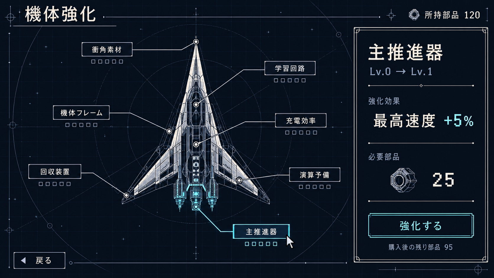
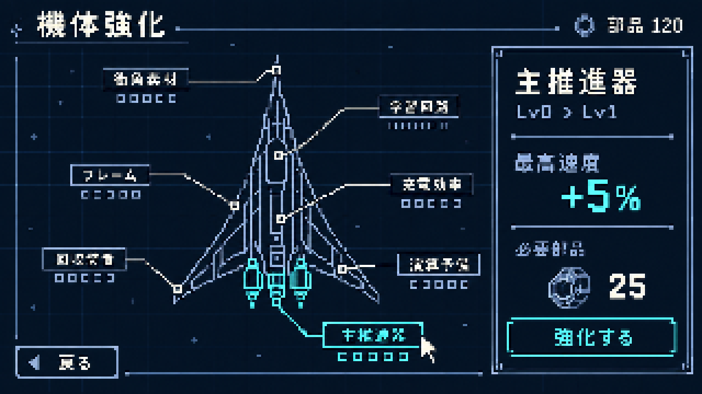

# 機体強化画面の案

未採用の候補。今の強化画面は一覧の形。

## 構成

中央に機体のワイヤーフレーム、各強化の部位から引き出し線、部位名のボタン。ホバーで右に効果と金額を出す。

- 中央の機体図から部位ボタンへ引き出し線を伸ばす。右に固定の詳細パネル、上に画面名と所持部品、左下に戻るボタン。
- 強化項目「衝角素材」「機体フレーム」「回収装置」「主推進器」「充電効率」「学習回路」「演算予備」を部位に割り当てる。部位との対応は画面上の見せ方だけで、強化の効果は変えない。
- ホバー中は部位・線・名前をシアンで連動して強調する。右に名称、今の Lv と次の Lv、効果、必要な部品、購入後の残りの部品を出す。
- 段階を示す小さな四角の数は、各強化の上限（`.tres`）に合わせる。

## 操作

- ホバーは情報の表示だけにし、右の「強化する」で購入する。
- カーソルが部位から外れても、最後に示した詳細を保つ。ほかの部位にホバーしたときに切り替える。
- キーボードのフォーカスとタッチの部位タップも、同じ選択表示にする。部品が足りないときは購入を無効にし、足りないことが分かる文言を出す。最大まで強化したら、次の Lv と購入ボタンを最大の表示に置き換える。
- 最初にどの部位を選んでおくか、クリックで選択を固定するかは未決。

## ピクセルのワイヤーフレーム版

機体図を塗りのないピクセルの線画にし、周りの UI もピクセル調にした版。

[原寸（320×180）](../art/ship-upgrade-pixel-wireframe-320x180-v2.png)

- 「機体フレーム」は「フレーム」と短くし、購入後の残りの行は省く。
- 原寸では部位名が細かいので、日本語のビットマップフォントと配置の調整が要る。
- 画面の解像度を固定するものではない。
