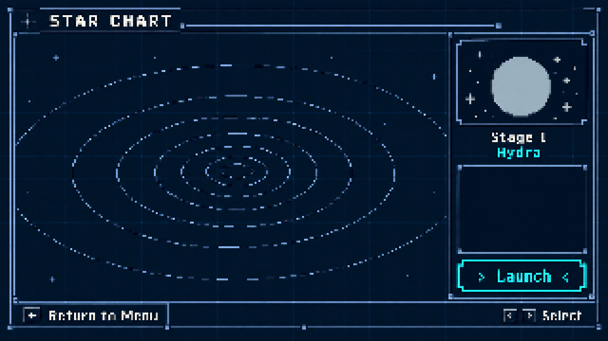

# ステージ選択画面の案

未採用の候補。機体強化画面のピクセルのワイヤーフレーム版（[機体強化画面の案](ship-upgrade-ui.md)）と同じ見た目にそろえた案。

[原寸（320×180）](../art/stage-select-blueprint-320x180-v1.png)

- 左に傾いた同心楕円の星図、右上に天体のプレビュー、ステージ名、詳細の枠、出発のボタン。下端に戻る操作と選択の表示。
- 青灰色の細い枠・四角い角・端点、濃紺の背景と控えめな方眼、アイボリーの文字、シアンの選択色。
- 星図の上のステージの位置や航路はまだ描いていない。天体と名称は仮。
- 原寸では楕円の破線などが細かいので、線のドットの置き方を調整する必要がある。画面の解像度を固定するものではない。

## ほかの画像

- [ナビ端末風](../art/stage-select-nav-terminal-320x180-v1.png)
- [星図](../art/stage-select-star-chart-320x180-v1.png)
- [傾いた海図](../art/stage-select-tilted-chart-320x180-v1.png)
