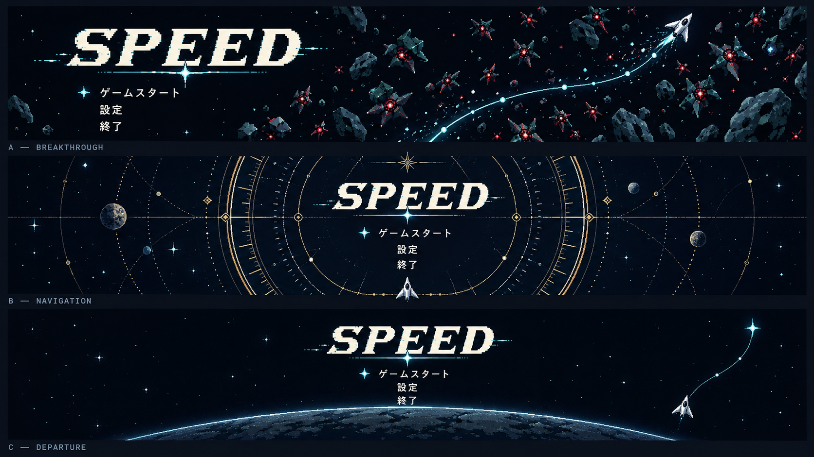

# タイトル画面の案

未採用の候補。メニューは「ゲームスタート」「設定」「終了」。

## 方向性

| 案 | 見せるもの | 狙い |
|---|---|---|
| 星図に最初の航路を引く | 濃紺の星空、薄い海図の目盛り、一本の曲線と自機 | 航海・星図の世界観と、経路を描く操作を同時に伝える |
| 群れを貫く自機 | 敵の群れを割って進む自機と軌跡 | 高速移動と突破の勢いを前に出す |
| 静かな星空と航路 | 少ない星、大きなロゴ、細い航路 | 余白と見やすさを優先し、操作の前の静けさを作る |

## 星図に最初の航路を引く案

- 左に大きな SPEED のロゴとメニュー、右に自機と航路。選択中の項目だけにシアンの星と細い枠を付ける。
- 星座の動物の絵は描かず、座標の円と目盛りにとどめる。
- 動き：星がゆっくり瞬く、自機が航路を緩やかに進む、選択の星が移る。スタートで航路を引き切って次の画面へ切り替える。
- 画像の下端の「Esc で戻る」は使わない（タイトル画面には戻る操作がない）。

## 3案の比較

| 案 | 内容 |
|---|---|
| A 群れを貫く | 左にロゴとメニュー、右に敵の群れを割る航路と自機。高速移動と突破の爽快感を強く見せる |
| B 航海図 | ロゴとメニューを中央に集め、真鍮色の同心円と目盛りで囲む。星図・航海の世界観を強く見せる。星座の動物の絵は使わない |
| C 静かな出発 | 中央にロゴとメニュー、下端に惑星、右に小さな自機。余白を広く取って出発前の静けさを見せる |

- 選択中の項目は星のマーカーで示す。
- 画像は横長に詰めた比較用。16:9 の完成レイアウトではなく、画面にするときに縦の余白とボタンの間隔を調整する。
