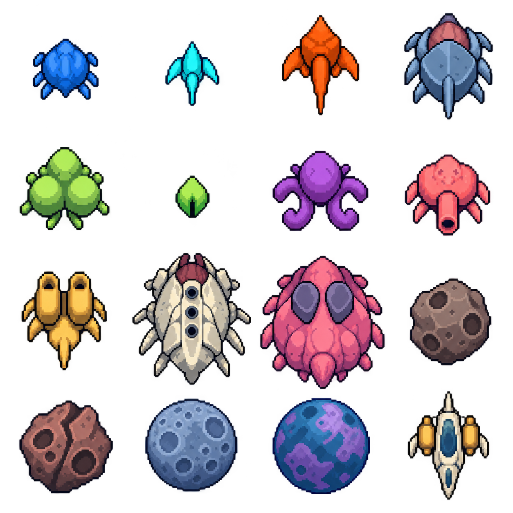

# ピクセル素材（2026-10-08）

## 手描き素材への差し替え（2026-10-09）

追加指定の `splitter.png`（45×45）も同名素材へ差し替え、原寸表示・当たり判定・準備ツールの上書き除外に対応。Armoredの背面弱点の黄色い弧は非表示とし、弱点判定は維持する。

提供PNGを加工せず採用した。`main_character.png` は `airship.png`、`meteor.png` は `meteor_0.png`、`meteor_2.png` は `meteor_1.png`、敵5種は同名へ配置。自機39×40、drifter 23×23、swarm 32×32、darter 32×36、armored 64×64、splitling 13×26、隕石120×120／80×80。

PNGの透明余白も保持し、1画像ピクセル＝1ワールド単位で描画する。上向きの自機と敵は進行方向へ回転する。エリートもこの原寸を維持し、円形の当たり判定は画像の長辺の半分とする。カメラのズームによる画面表示倍率は従来どおり。隕石は配置IDで画像を選び、画像に対応する判定サイズを使う。準備ツールはこれらの手描き素材を上書きしない。以下は旧素材の制作記録。

ユーザー提供の敵のコンセプト画像を参照し、組み込みimagegenで透過アトラス `source-atlas.png` を制作した。素材は試遊用に採用。敵のステータス・半径・行動は既存 `.tres` のまま。

アトラスから `tools/prepare_pixel_assets.gd` で透過範囲を切り出し、Nearestで小さなPNGに整えている。生成画像の3段目は均等セルを越えるため、スクリプトに実際の切り出し境界を記録した。ランタイムは個別PNGを通常のTexture2Dとして読む。元アトラスのファイル読み込みは準備ツールだけで使う。

| 段 | 左から1番目 | 2番目 | 3番目 | 4番目 |
|---|---|---|---|---|
| 1段目 | drifter | swarm | darter | armored |
| 2段目 | splitter | splitling | leech | gunner |
| 3段目 | missile | battleship | titan | meteor_0 |
| 4段目 | meteor_1 | moon | planet | airship |

上の表はアトラス画像と同じ配置。敵と自機は下向き。描画時にゲーム内の向きへ回転する。敵の長辺は半径の2倍で、透明な余白によって種類間のサイズ比が変わらない。月と惑星は障害物の直径へ合わせる。背面弱点・HP・予告・エリート表示は素材と別に重ねる。個別アニメーションはまだない。

## 敵の名前と実装アートの対応



| 名称／ID | 見た目 | アトラス位置 | 役割 |
|---|---|---|---|
| ドリフター `drifter` | 青い丸い体と短い脚 | 1段目・左から1番目 | 追跡 |
| スウォーム `swarm` | シアンの小さな翼と細い体 | 1段目・2番目 | 小型の追跡 |
| ダーター `darter` | 橙色の尖った頭と長い突起 | 1段目・3番目 | 突進 |
| 装甲型 `armored` | 青灰色の大きな甲殻と赤茶色の背面 | 1段目・4番目 | 硬い追跡敵、背面弱点 |
| 分裂型 `splitter` | 黄緑色の丸い塊が三つ集まった体 | 2段目・1番目 | 分裂体を生む |
| 分裂体 `splitling` | 緑色の小さな雫形 | 2段目・2番目 | 分裂後の小型追跡敵 |
| 減速型／リーチ `leech` | 紫色の丸い体と四つの曲がった触手 | 2段目・3番目 | 周囲の自機を減速 |
| 射撃型 `gunner` | サーモンピンクの体と一つの砲口 | 2段目・4番目 | 通常弾を射撃 |
| ミサイル艇 `missile` | 黄色の二本の発射器 | 3段目・1番目 | 誘導弾を射撃 |
| 戦艦 `battleship` | アイボリー色の大きな体と三つの砲口 | 3段目・2番目 | 扇状射撃、背面弱点 |
| タイタン `titan` | 大きなピンクの体と紫灰色の二つの面 | 3段目・3番目 | 大型の追跡敵 |

これは現在の試遊用素材の対応で、最終デザインの確定ではない。アトラス内の絵の大きさはゲーム内のサイズ比を表さない。仮ボスは戦艦画像を共用している。

```powershell
godot --headless --path speed --script res://tools/prepare_pixel_assets.gd
godot --headless --path speed --editor --import --quit
godot --path speed res://tools/preview_pixel_assets.tscn
```

最後のコマンドへ `-- --capture` を付けると、数フレームの静止描画後に `speed/.godot/pixel-preview.png` を保存して終了する。自動プレイではなく、実Rendererで全素材・被弾フラッシュ・弱点とHPを確認するシーン。

通常のF5実行に設定変更は不要。Godot 4.6のこの環境のDirect3D 12では既存GPU火花のパイプライン生成が失敗するため、D3D12では既存CPU火花を使う。Vulkanの経路は変更しない。

生成プロンプト全文は [generation-prompt.txt](generation-prompt.txt)。
