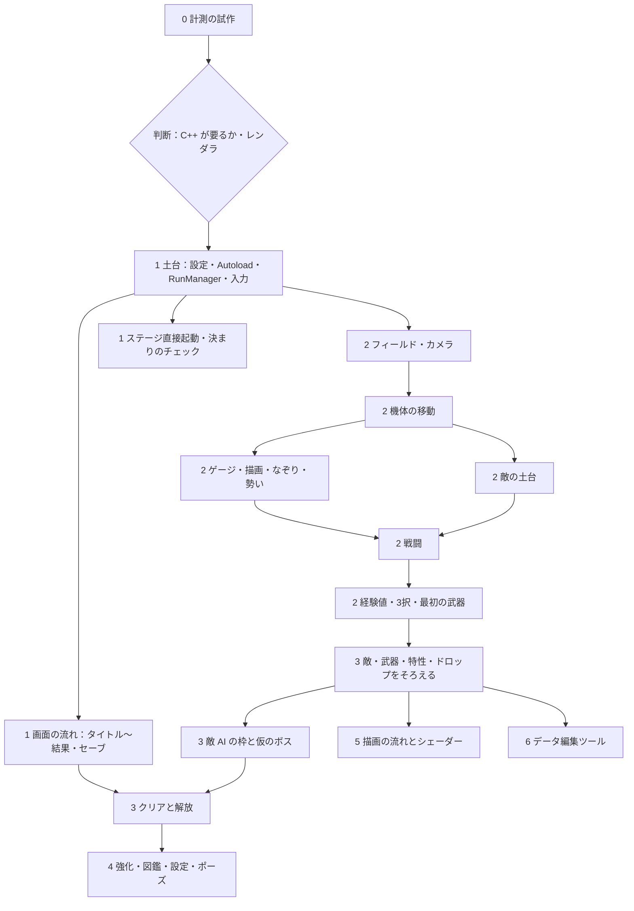

# 実装計画（作業用・一時）

Godot 本番の最初の実装の計画。作業用の一時的な文書で、実装が終わったら消すか記録として残すかを決める。ゲームの中身は [仕様書](../docs/spec.md)、構成は [設計書](../docs/design.md) を正とし、ここには新しい仕様を書かない。タスクの一覧は [todo.md](todo.md)。

## 前提

- 範囲：計測の試作 → 土台と画面の流れ → 1回のランの芯 → 中身をそろえる → メタと設定 → 描画の流れとシェーダー → ツール。
- Godot はこの Mac の 4.6.3 標準版（`/Applications/Godot.app`）。GDScript。敵 AI は LimboAI v1.8.1 の GDExtension 版（ダウンロードは許可済み）。レンダラは計測で決めるまで Forward+。
- 自動テストは作らず実行しない（AGENTS.md）。確認は読み込みエラー・書き出した画面・計測の数値で行う。
- 数値は `.tres` に入れる。仕様にない機能を足さない。demo のコードは移植せず、挙動を確かめる参考にだけ使う。
- 自分の変更だけをコミットする。push は各段階（チェックポイント）の終わりにまとめる。
- 先に聞くこと：LimboAI 以外の追加機能、project.godot の大きな設定の変更、仕様の読み方が分かれるところ。

**仮置き**：各ステージの中身は当面 demo と同じ10分のランと仮のボス。エンドレスはステージ選択に入口だけ置く。見た目は仮の図形。音は仕組みだけ。

**今回やらないこと**：見た目の方向性、中ボス4体とラスボスの攻撃、フィールドの仕掛け、ラスボス戦の締め、エンドレスの中身、BGM、Steam 連携と書き出し、ブラウザ版。

## 確認のコマンド

```bash
GODOT=/Applications/Godot.app/Contents/MacOS/Godot
$GODOT --headless --path speed --import                          # 取り込みとスクリプトの読み込みエラーの確認
$GODOT --path speed res://gyms/perf_enemies/perf_enemies.tscn    # 計測シーンの実行（数値はログに出す）
$GODOT --path speed --rendering-method mobile <シーン>            # レンダラを切り替えて実行
$GODOT --path speed <シーン> --write-movie <出力>.png --fixed-fps 60 --quit-after <フレーム数>   # 画面を画像に書き出す
$GODOT --headless --path speed --script res://tests/check_rules.gd   # 決まりの自動チェック（4.4）
```

## 依存関係



## 段階とチェックポイント

各段階は、遊べる一本道を少しずつ太くする順にしている（層ごとに作り切ってからつなぐ形にはしない）。

| 段階 | 中身 | チェックポイント（ここでユーザーが確認する） |
|---|---|---|
| 0 計測 | 敵1300体を GDScript で回す。Forward+ と Mobile を比べる | 数値を報告し、C++ が要るか・レンダラを決めてもらう |
| 1 土台と画面の流れ | 設定、Autoload、空のランを含む画面の一本道、セーブ、ステージ直接起動、決まりのチェック | F5 でタイトル → ステージ選択 → 空のラン → 結果 → ステージ2解放、まで押して確認 |
| 2 ランの芯 | フィールド、機体、描いて駆け抜ける、敵1種、戦闘、経験値と3択、ブラスター | 実際に遊んで、demo と手触りが同じか確認 |
| 3 中身 | 敵11種、時間帯の表、武器9種、特性14種、ドロップ、隕石、破片、LimboAI と仮のボス、撃破・敗北の演出 | ステージ1を10分通しで遊び、仮のボスを倒してステージ2が解放される |
| 4 メタと設定 | 強化画面、図鑑、設定（音量・画面モード・キー）、ポーズからメインメニュー、調整パネル | 画面をひととおり触って確認 |
| 5 描画 | 層と段の描画の流れ、演出のシェーダー、コンピュートの演出、光のにじみ | 画面と計測（60fps）を確認 |
| 6 ツール | データ編集ツール、文書の数値を `.tres` へ移して外す | ツールで数値を変えて遊べることを確認 |

## 危険と対策

| 危険 | 対策 |
|---|---|
| GDScript では敵1300体が 60fps で回らない | 段階0で先に確かめる。足りなければ、その部分だけ C++（GDExtension）に置き換える案を出す |
| LimboAI が Godot 4.6.3 で動かない | 段階3の最初に導入して確かめる。動かなければ代わりの案（Beehave、自作）を相談する |
| demo と手触りが変わる | 数値は demo から引き継いだ `.tres`。段階2のチェックポイントで遊び比べる |
| 録画機能での画面確認がうまくいかない | その場合は、実行中の画面を撮る方法に切り替える |
| 別の作業と同じファイルを触る | 自分の変更だけをコミットし、ほかの作業の未コミットの変更には触れない |
